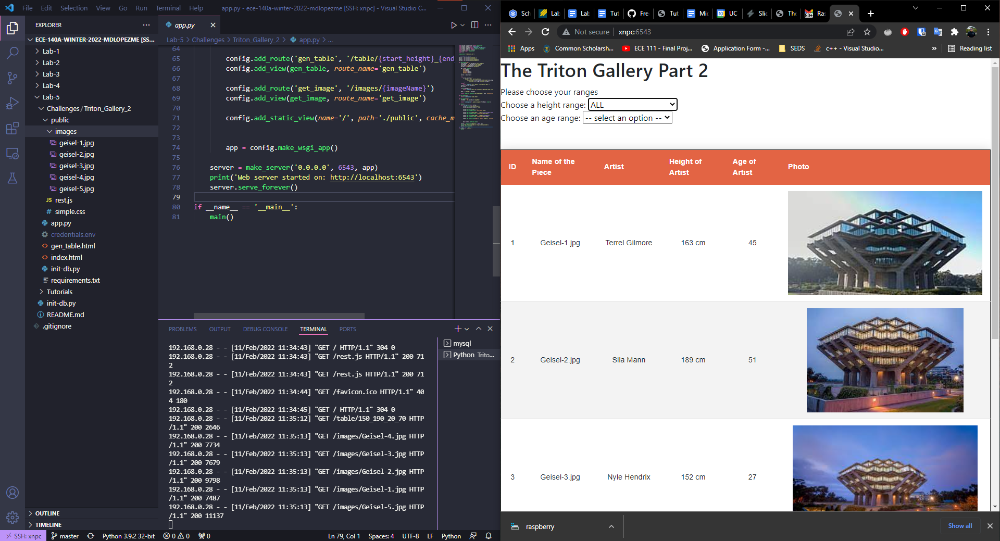

Moises Lopez 
Olivier Rogers A16069362

# Lab 6 Midterm

## Tutorial 1: Setup Raspberry Pi

Setting up the Raspberry Pi is similar to setting up a headless linux machine, except the imaging tool from [raspberrypi](https://www.raspberrypi.com/software/) makes it even easier by setting up wifi and ssh in the image.   

Setting up SQL was nearly identical to that on my system with the main difference being the package manager used (apt on the pi and pacman on my system).  

We decided to stick with ssh for logging into the raspberrypi, since we are both used to the linux cli and VS Code works nicely over ssh.  

|  |
|:--- |
| *Challenge 1 from Lab 5 (Olivier), logged in over ssh and running the server app. The browser loads the website from host suffix 100 on the LAN. The user workstation uses suffix 14.* |

Moises' Screenshot 

As asked in the tutorial 1, here is a screenshot of the raspberry pi serving my triton gallery implementation.

Why do you see windows interface? Same reason as above
The hostname of my pi is xnpc. So, the webserver is running on the pi.

## Midterm
